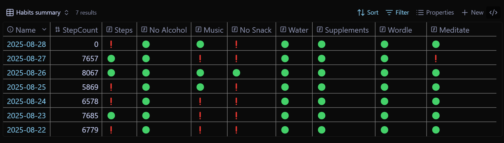
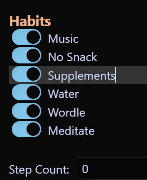
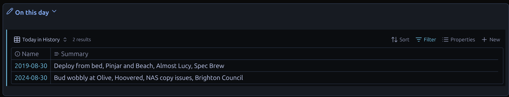

# Obsidian-Code-snippets
These are some of the bits of code that I use in my Obsidian vault. They are often specific to my workflow and note structure, so please don't just run them, but use them as a reference or starting point for your own customisations. 

## Table of Contents

- [Installation](#installation)
- [Datacore](#datacore)
  - [ProgressBarTasks.md](#progressbartasksmd)
  - [Time Progression.md](#time-progressionmd)
- [Quickadd Macro](#quickadd-macro)
  - [InputHelper.js](#inputhelperjs)
  - [LastUpdated.js](#lastupdatedjs)
  - [UnSchedule.js](#unschedulejs)
- [Python](#python)
  - [obstask.py](#obstaskpy)
- [Bases](#bases)
  - [CreatedToday.base](#createdtodaybase)
  - [HabitSummary.base_imbed](#habitsummarybase_imbed)
  - [OldestModDate.base](#oldestmoddatebase)
  - [PreviousYears.base](#previousyearsbase)
  - [ThisWeek Notes.base](#thisweek-notesbase)
  - [Today Notes.base](#today-notesbase)
  - [WeeklySummary.base](#weeklysummarybase)
- [Miscellaneous](#miscellaneous)
  - [AutoHotkey helpers.txt](#autohotkey-helperstxt)
  - [Callout Insert.md](#callout-insertmd)
  - [Current Plugins.md](#current-pluginsmd)
  - [Kanban Weekly No Reminders.md](#kanban-weekly-no-remindersmd)
  - [Random Wikipedia Page.md](#random-wikipedia-pagemd)
  - [Rob.css](#robcss)

# Installation
1. Download the code from this repository.
2. Place the downloaded files in the appropriate Obsidian folder:
    - I keep javascript and base files in a _Templates folder.
    - Most of the datacore is inline, or kept in the _Templates folder.

# Datacore
As of 2025-08-20, Datacore was still in beta, so needed to be installed using BRAT. I have replaced all dataview in my vault with bases or datacore.
### ProgressBarTasks.md


This is a datacore progress bar that I imbed using dynamic imbed (so that it uses the owning file for the query) that will look for all tasks, and all completed tasks in the note and provide a quick visual summary of the progress. 
````
```dynamic-embed
[[ProgressBarTasks]]
```
````
I use this in many of my [25 for 2025](https://robcoles.net/posts/25-for-2025/) notes, and use the progress bar code itself as the basis for tracking multiple objectives in weekly, quarterly and annual notes.

The file is kept in my _Templates folder.

### Time Progression.md


This is my version of Mike Schmitz's memento mori and Joshi Pax's extension. It's a datacore query that I imbed in my daily note as a reminder. I don't update it dynamically (you could get it to update the day percentage periodically).

To use, you would need to update the birthday and lifespanYears variables. I calculated the lifespan years from an online calculator that took into account my diet, exercise and where I lived etc.

I use the same dynamic imbed plug-in as for the progressbartasks above to include this file, as using a regular imbed gave me issues on mobile.

# Quickadd Macro
### InputHelper.js
I use a number of standard bits of YAML frontmatter, with metabind fields in the body of the note to track things I do, and to help my workflow. This helper is make things easier and less error-prone. It's intended to run as a QuickAdd macro. When triggered by a hotkey it gives me a list of possible metadata to add, and on selection, will prompt for the value and create the frontmatter and insert the metabind string at the cursor location. For example:


Most of the options prompt for a single value. Scheduled pre-fills my most used dates relative to today for selection.


These use the Quickadd suggester. Picking a scheduled date for example, will add the frontmatter and a Metabind string:
```
Scheduled: `INPUT[date:Scheduled]`
```

So I can see the scheduled date inline.


### LastUpdated.js
This should really be re-named to LastReviewed. I am trying to remove dependence on the obsidian create and change date as these can be changed by the file system, so I have a QuickAdd hotkey and script combination which will create or update a "Last reviewed" date which is guaranteed to mean I did something with it rather than the file system. 

The QuickAdd hotkey triggers this script and I end up with frontmatter and the metabind:

```
Last reviewed: `INPUT[date:LastReviewed]`
```

Which looks like:


### UnSchedule.js
This is just a quick way to remove the frontmatter and metabind entries for the scheduled date and next action. Typically I would use this if I had a task I had needed to do, but I had made useful notes that I wanted to keep. I would remove the next action and scheduled date and then move the note to archive.

# Python
### obstask.pyw
This is a quick capture attempt. I have quick capture built into AutoHotkey, but that just captures text. This function allows quick capture specifically for new tasks and includes my prioritisation, tags and frontmatter/metabind.


There is a natural language entry built in allowing all fields to be populated from the Note Title field. This was an experiment in vibe coding.

I broadly follow a [GTD](https://gettingthingsdone.com/)/[Secret weapon](https://thesecretweapon.org/the-secret-weapon-manifesto/the-secret-weapon/) workflow. 

# Bases
### CreatedToday.base
This is a base I imbed in my daily note that shows all notes with a created date that matches the file name. My daily notes are all named following the YYYY-MM-DD convention.

### HabitSummary.base_imbed
I track a few habits using YAML and this is a quick way to get an overview. This is an inline base rather than an imbed as the habits I am tracking can change through the year. I'm doing "tiny experiments" lasting a month, with meditation being the current one. 

I was using a red "X" instead of the red exclamation mark, but this wasn't rendering correctly on Linux Mint.

The daily capture uses Meta bind to make maintaining the YAML easy. It looks like:

### OldestModDate.base
This base is a part of my [Note Gardening](https://robcoles.net/posts/note-gardening/) process. It will use the Obsidian/System last modified date and just display the 10 oldest notes. I look at this list as part of my weekly review and will cleanup, link or delete as needed.

### PreviousYears.base
This is my version of "On this day in history". This base will display a list of my notes from my journal for the same month and day, excluding today's note. It's in a callout to allow it to be hidden. I am going through a process of transcribing the last 4 years from a 5-year diary so the usefulness will increase as more data is available.


### ThisWeek Notes.base
This base is imbedded in my daily note and is a part of my daily planning process. It selects all notes with a link of "2-ThisWeek" which are notes I want to deal with this week but not necessarily immediately. This base is inside a callout. When I'm looking at what I will do today, depending on what other commitments I have I will review this list and either pull an entry out to work on today if I have capacity (Changing the link to 1-Today), demoting it to "3-Soon" or deleting it if it isn't relevant any more. The links are based on a [GTD](https://gettingthingsdone.com/)/[Secret weapon](https://thesecretweapon.org/the-secret-weapon-manifesto/the-secret-weapon/) workflow.


### Today Notes.base

### WeeklySummary.base

# Miscellaneous
### AutoHotkey helpers.txt
### Callout Insert.md
### Current Plugins.md
### Kanban Weekly No Reminders.md
### Random Wikipedia Page.md  
### Rob.css


