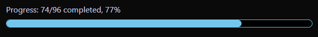
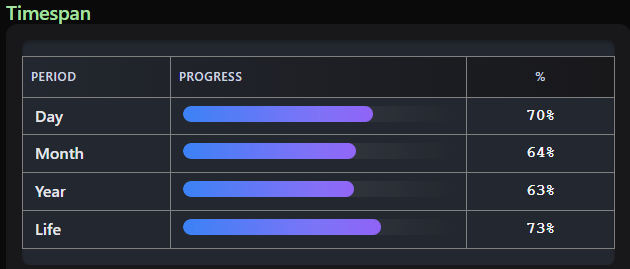
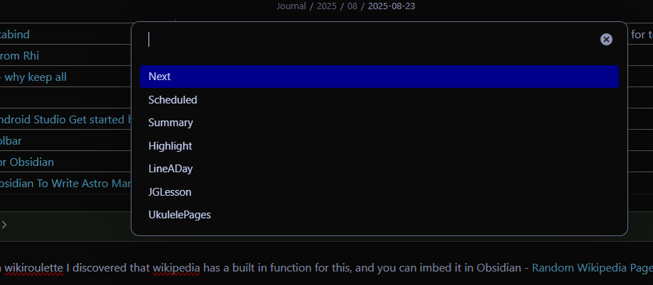
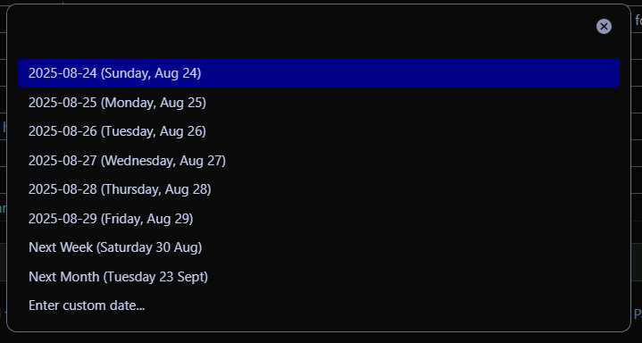
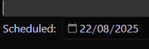
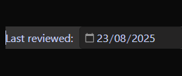
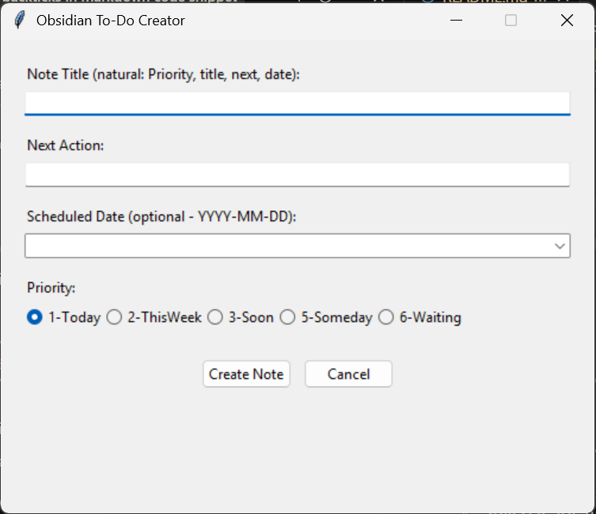

# Obsidian-Code-snippets
These are some of the bits of code that I use in my Obsidian vault. They are often specific to my workflow and note structure, so please don't just run them, but use them as a reference or starting point for your own customisations. 

# Installation
1. Download the code from this repository.
2. Place the downloaded files in the appropriate Obsidian folder:
    - I keep javascript and base files in a _Templates folder.
    - Most of the datacore is inline, or kept in the _Templates folder.

# Datacore
As of 2025-08-20, Datacore was still in beta, so needed to be installed using BRAT. I have replaced all dataview in my vault with bases or datacore.
### ProgressBarTasks.md


This is a datacore progress bar that I imbed using dynamic imbed (so that it uses the owning file for the query) that will look for all tasks, and all completed tasks in the note and provide a quick visual summary of the progress. 
````
```dynamic-embed
[[ProgressBarTasks]]
```
````
I use this in many of my [25 for 2025](https://robcoles.net/posts/25-for-2025/) notes, and use the progress bar code itself as the basis for tracking multiple objectives in weekly, quarterly and annual notes.

The file is kept in my _Templates folder.

### Time Progression.md


This is my version of Mike Schmitz's memento mori and Joshi Pax's extension. It's a datacore query that I imbed in my daily note as a reminder. I don't update it dynamically (you could get it to update the day percentage periodically).

To use, you would need to update the birthday and lifespanYears variables. I calculated the lifespan years from an online calculator that took into account my diet, exercise and where I lived etc.

I use the same dynamic imbed plug-in as for the progressbartasks above to include this file, as using a regular imbed gave me issues on mobile.

# Quickadd Macro
### InputHelper.js
I use a number of standard bits of YAML frontmatter, with metabind fields in the body of the note to track things I do, and to help my workflow. This helper is make things easier and less error-prone. It's intended to run as a QuickAdd macro. When triggered by a hotkey it gives me a list of possible metadata to add, and on selection, will prompt for the value and create the frontmatter and insert the metabind string at the cursor location. For example:


Most of the options prompt for a single value. Scheduled pre-fills my most used dates relative to today for selection.


These use the Quickadd suggester. Picking a scheduled date for example, will add the frontmatter and a Metabind string:
```
Scheduled: `INPUT[date:Scheduled]`
```

So I can see the scheduled date inline.


### LastUpdated.js
This should really be re-named to LastReviewed. I am trying to remove dependence on the obsidian create and change date as these can be changed by the file system, so I have a QuickAdd hotkey and script combination which will create or update a "Last reviewed" date which is guaranteed to mean I did something with it rather than the file system. 

The QuickAdd hotkey triggers this script and I end up with frontmatter and the metabind:

```
Last reviewed: `INPUT[date:LastReviewed]`
```

Which looks like:



### UnSchedule.js
This is just a quick way to remove the frontmatter and metabind entries for the scheduled date and next action. Typically I would use this if I had a task I had needed to do, but I had made useful notes that I wanted to keep. I would remove the next action and scheduled date and then move the note to archive.

# Python
### obstask.py
This is a quick capture attempt. I have quick capture built into AutoHotkey, but that just captures text. This function allows quick capture specifically for new tasks and includes my prioritisation, tags and frontmatter/metabind.



There is a quick entry built in allowing all fields to be populated from the Note Title field. This was an experiment in vibe coding.

# Bases
### CreatedToday.base
### HabitSummary.base_imbed
### OldestModDate.base
### PreviousYears.base
### ThisWeek Notes.base
### Today Notes.base
### WeeklySummary.base

# Miscellaneous
### AutoHotkey helpers.txt
### Callout Insert.md
### Current Plugins.md
### Kanban Weekly No Reminders.md
### Random Wikipedia Page.md  
### Rob.css


